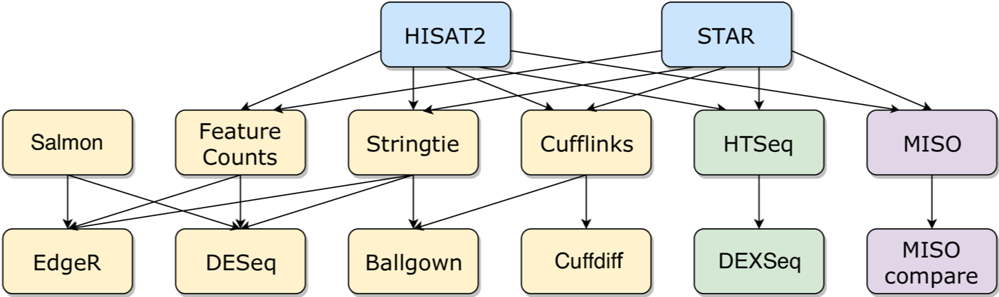
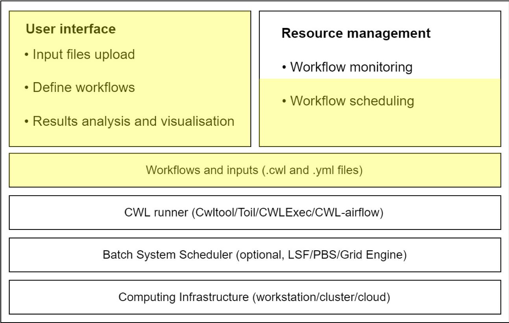

# RAWG: RNA-Seq Analysis Workflow Generator

RAWG is born out of a student project at Imperial College London. The aim of this project is to provide an easy and intuitive way for researchers to conduct RNA-Seq analysis and compare different analysis pipelines, by automatically generating workflows based on user-selected tools.

- For an online demo of the front-end interface, please see [user guide](/doc/userguide.md) and [demo](http://rawg.tony.tc).

- For a detailed write-up, please see [report](https://github.com/rawgene/rawg/blob/master/doc/RNASeq_report_CC.pdf)

- Please see [setup guide](doc/setupguide.md) for instructions on setting up RAWG

Note: RAWG was previously hosted in a single repo under a personal account (with 700+ commits). The project was reorganised and transferred to this organisational account to better decouple different components of RAWG. The origanal project, which is under archival now, can be seen [here](https://github.com/tonyyzy/RNASeq/)

At its core, RAWG is built with three components:

- A website based on Django framework, served as user interface ([repo link](https://github.com/rawgene/webportal))
- A set of python scripts that generate cwl workflows ([repo link](https://github.com/rawgene/flowgen))
- A collection of RNA-Seq tools packaged in cwl scripts ([repo link](https://github.com/rawgene/cwl))

RAWG was presented as a [lighting talk](https://www.youtube.com/watch?v=kEqR0OsgKXk) and [poster](https://f1000research.com/posters/8-1215) at BOSC2019 in Basel, Switzerland.

## Motivation

RNA sequencing (RNA-Seq) is becoming the golden standard for analysing gene expressions in biological samples. Many analysis pipelines were developed, enabling standardisation and automation of RNA-Seq data analysis. However, different methodologies leads to wide variation in the number of genes called significant and different workflows exhibit a precision/recall tradeoff. Therefore, the ultimate choice of workflow should take into consideration how the results will be used in subsequent applications ([Williams *et al.*](https://bmcbioinformatics.biomedcentral.com/articles/10.1186/s12859-016-1457-z)).  

RAWG is our solution to the ever-evolving RNASeq tools. We aim to provide a comprehensive and easy to use platform that researchers have the freedom of choosing different tools based on their need.

### Current tools

We have included tools for differential gene expression (DGE), differential isoform expression (DIE) and differential exon expression. The complete tools and possible connections are shown below.

### RAWG architecture

A typical setup of an analysis workflow system using CWL is shown below. RAWG's premises is highlighted in yellow. By design, RAWG's components are highly decoupled which means different parts can be substituted for different purposes. Meanwhile, this architecture allows the change of CWL runner so that RAWG can support more platforms.

## Current stage of development

RAWG is still in its infancy, we are actively looking for contributors and welcome any comments, suggesttions and ideas. In particular, we are looking for

- Web developer: to furnish our Django website and improve visualisation functionality.
- Server-side developer: our framework for generating workflows need refactor and make integrating new tools easier.
- Researchers with RNASeq experience: what tools do you use which are not currently available on RAWG? How does RAWG compare to your current analysis experience?
