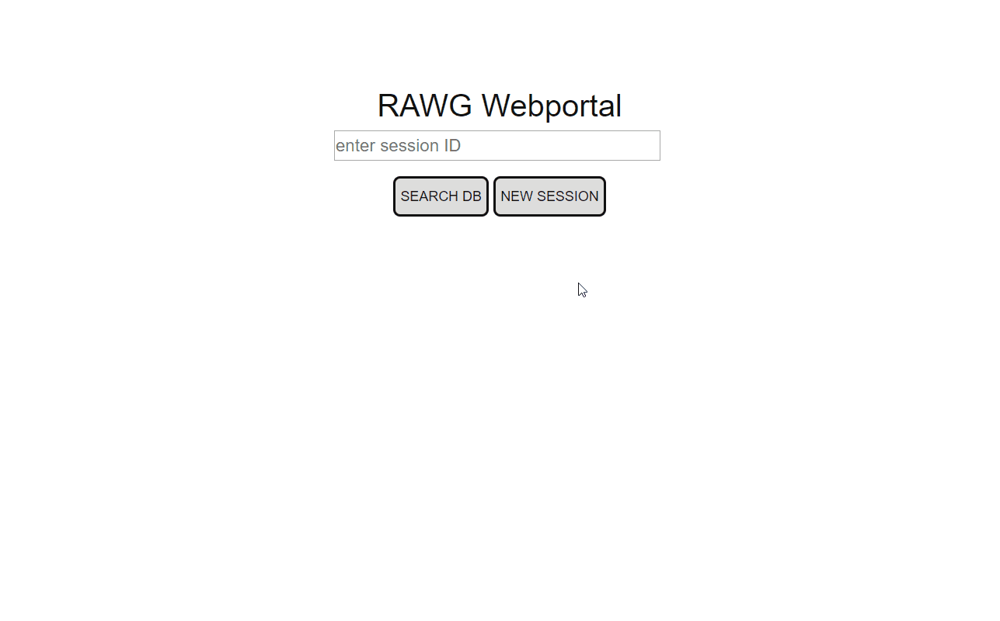
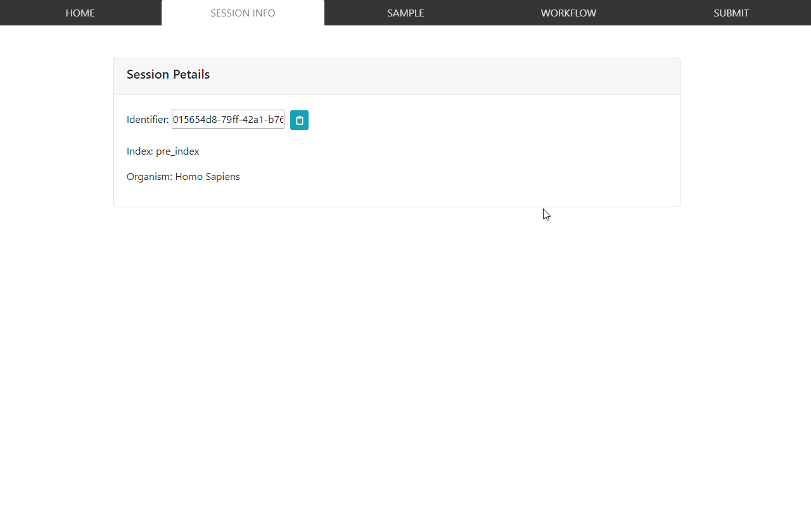
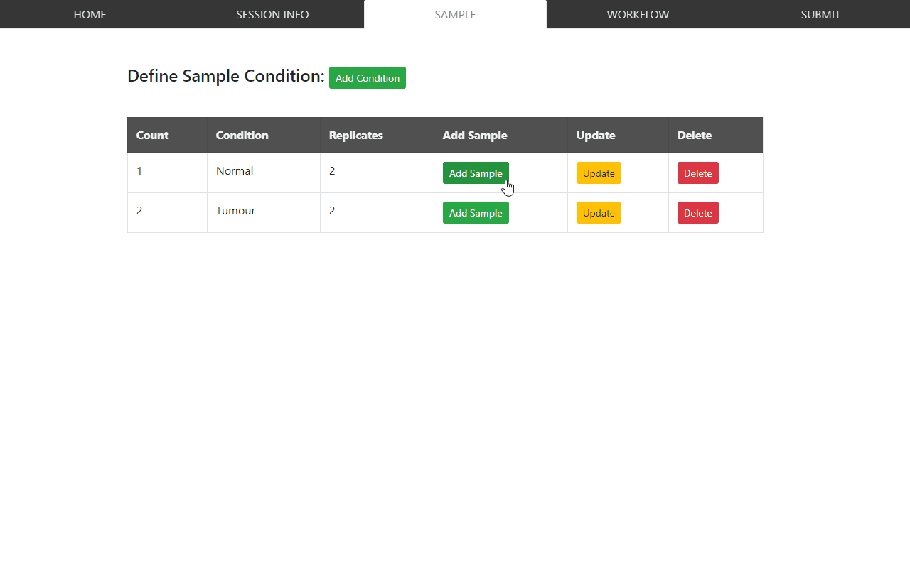
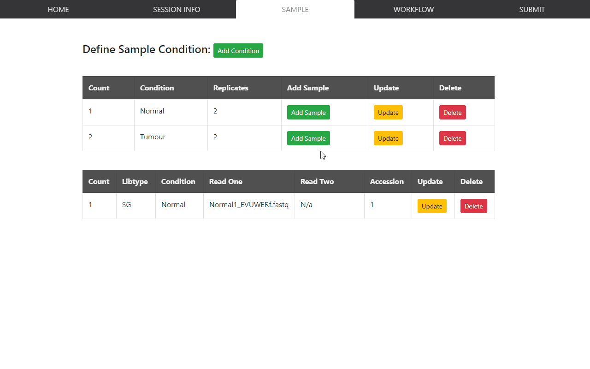
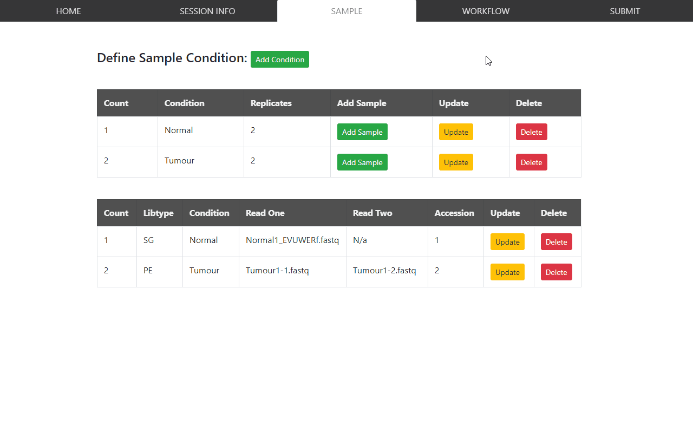
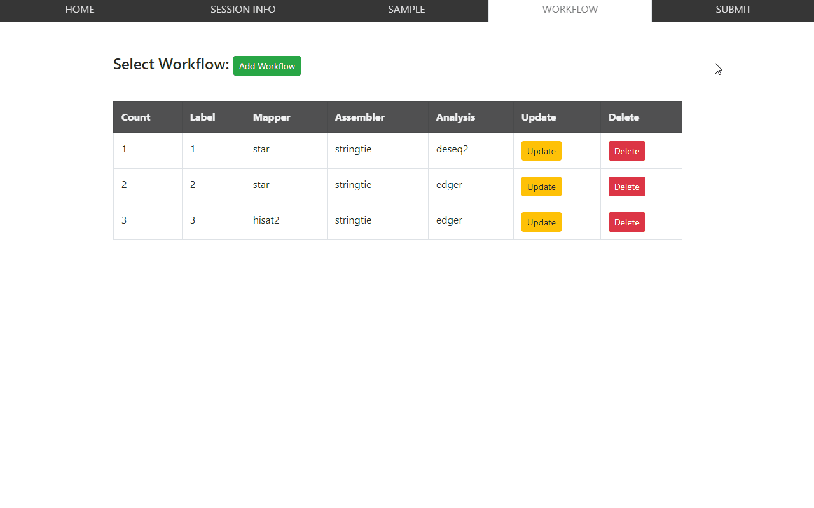
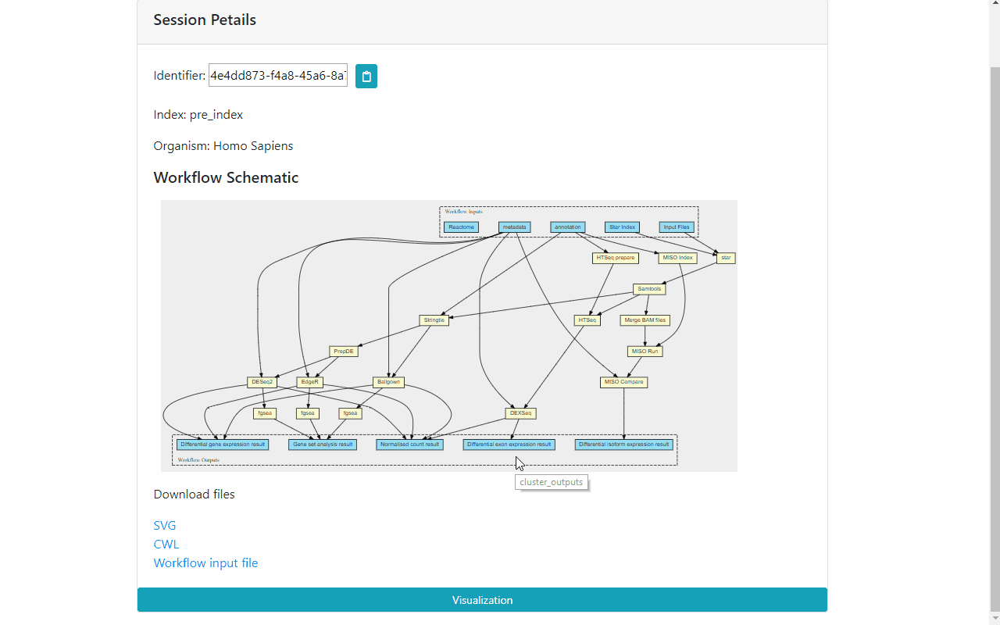

# RAWG User Guide

## Demo server

A demo server for RAWG is available [here](http://rawg.tony.tc). Note that due to resource constraint, this is only meant to demonstrate the front-end capability of RAWG, hence analysis workflows will not run.

## Website user guide

### Create a new session

In RAWG's setup, web admin can provide pre-generated genome index files for analysis. Users hence have two choices when creating a new session 1) use provided genome files 2) upload own genome and annotation files.  
In the example below, Preindexed genome files are selected for Homo Sapiens. After creating the session, user will be directed to the **SESSION INFO** tab which shows user the overview infomation and an identifier so that user can retrieve this session from the home page.


### Create conditions

After creating the session, user can add sample conditions (contrast) and specify number of replicates from the **SAMPLE** tab. An arbitary number of conditions can be added and RAWG will conduct pairwise differential analysis for all the possible contrast pairs. 


### Add samples

RAWG is configure to take both single reads and paired-end reads although it's not a good idea to mix sample types in the same comparison. RAWG can take fastq files or compressed fastq files (.gz format).

#### single read sample



#### paired-end sample



### Add workflows

After uploading all samples and specified the conditions, the user is then directed to define workflows. From the **WORKFLOW** tab, user can add an arbitary number of workflows.  
In this example, three workflows were defined

- STAR - Stringtie - DESeq2
- STAR - Stringtie - edgeR
- HISAT2 - Stringtie - edgeR  

This shows that RAWG is able to reused the common results (STAR - Stringtie) for different downstream analysis.



### Submit analysis

Finally, the defined session is submitted. A workflow schematic is generated and displayed in the **SESSION INFO** tab. This schematic tries to follow [CWL viewer](https://view.commonwl.org/)'s style. At the bottem of the same tab, the schematic, cwl workfklow file and input file can be downloaded. The cwl files can be used for local execution as long as files paths are correctly resolved. Note that the workflow generation script runs every 15 s on the server so you may need to wait 15 s at most.

KNOWN ISSUE: the workflow schematic will not display automatically and the user needs to refresh the webpage for the diagram to load correctly.


### (Experimental) Visualisation functionality

We have implemented some minimal visualisation functionalities, volcano plot and bar plot. The visualisation page is accessible from the bottem of the **SESSION INFO** tab

The volcano plot allows user to quickly pick out the significant genes and more than one pair of contrast can be shown on the same diagram. Users can also adjust the p-value and logfold change threshold interactively. Mouse hovering over a dot on the plot shows the gene accession and relevant data at the bottom of the plot.  

The bar plot is a simple diagram that tells user the number of significant genes found based on user-selected parameters.



To try out the visualisation functions yourself, you can use identifier `4e4dd873-f4a8-45a6-8a74-7b67173568b4` to input at the [homepage](http://rawg.tony.tc) and access this session. Or you can click [this link](http://rawg.tony.tc/visualization/4e4dd873-f4a8-45a6-8a74-7b67173568b4/) directly.

To produce the plot, you need to first select data from the selection menu on the left then click the **Volcano Plot** or **Bar Plot** tab heading. Note that some complex data set can take ~ 1 min to plot.

## Appendix

### Command used to set up the demo server

The [demo](http://rawg.tony.tc) is hosted on a DigitalOcean droplet with minimum comuptational resource hence it is only meant to be a demonstration for the front-end interface. This droplet uses Ubuntu 18.04 as base image.  
Here is the history shows commands used to set up the demo server

```sh
root@rawg:~# history
    1  git clone --recurse-submodules -j3 https://github.com/rawgene/rawg
    2  apt update
    3  apt install graphviz python3-pip
    4  cd rawg/webportal/webportal/
    5  cp settings.py local_settings.py
    6  vim local_settings.py 
    7  cd ../..
    8  pip3 install -r requirements.txt 
    9  cd webportal/
   10  python3 manage.py makemigrations
   11  python3 manage.py migrate
   12  nohup python3 manage.py runserver 0.0.0.0:80 &
```
